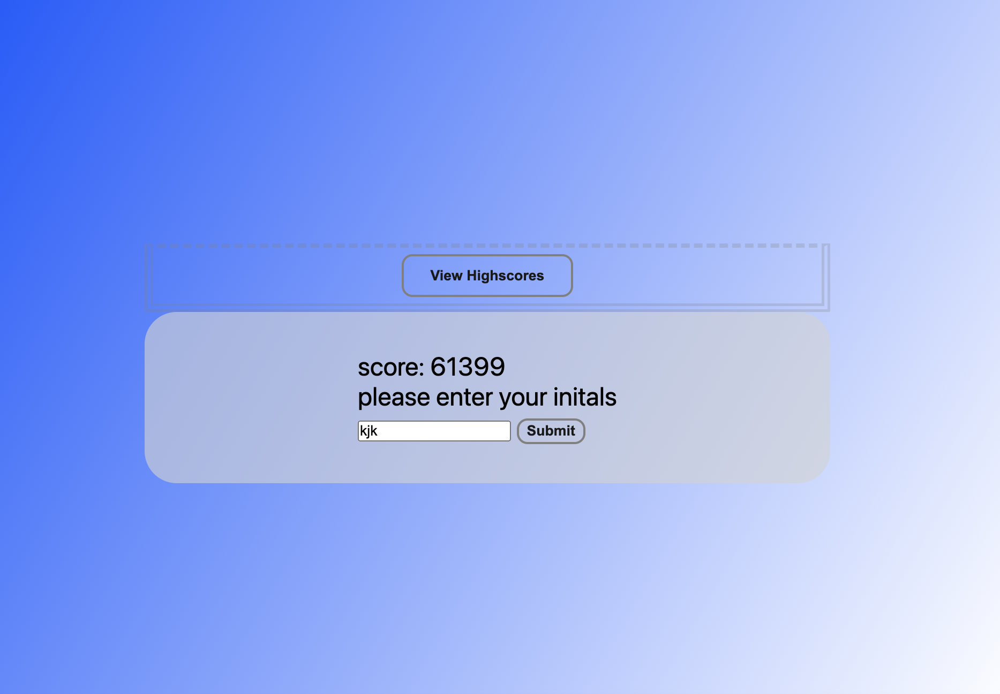

# Developer Quiz

## Description
This assignment showcases a timed quiz of questions related to coding concepts using Javascript, HTML and CSS styling. When the start button is clicked, a timer starts and the user is presented with a series of questions. If a question is answered correctly, points are awarded. If a question is answered incorrectly, time is subtracted from the clock. When the game is over, your score is calculated with points for correct answers plus the time remaining on the clock. The user is then able to save high scores to localStorage and clear them if desired. 

## Screenshots

## Links

[Github Repo](https://github.com/kevinkraiss/developer-quiz)

[Live Application](https://kevinkraiss.github.io/developer-quiz/)